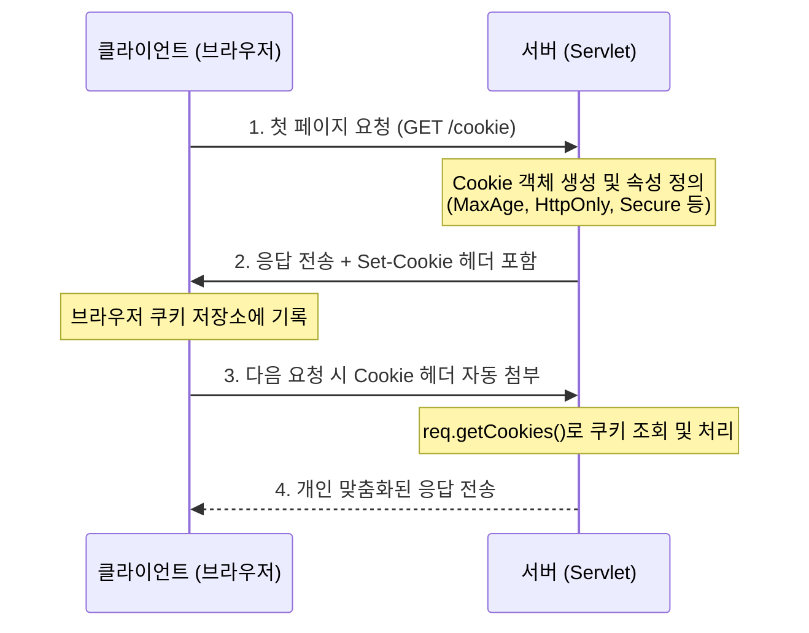

# Step 1: 쿠키 (Cookie) 개념 및 원리 정리

본 문서는 [CookieServlet.java](file:///Users/morgan/Documents/workspace/cookiesession/src/main/java/com/example/cookiesession/step1/CookieServlet.java) 및 관련 뷰 파일([cookie.jsp](file:///Users/morgan/Documents/workspace/cookiesession/src/main/webapp/WEB-INF/views/step01/cookie.jsp), [index.jsp](file:///Users/morgan/Documents/workspace/cookiesession/src/main/webapp/index.jsp))에서 다루는 쿠키의 개념과 보안 메커니즘을 세 단계(비유, 원리, 면접)로 정리한 문서입니다.

---

## 1. 초보자를 위한 비유

### 🍪 쿠키(Cookie)란 무엇일까요?
쿠키는 단골 카페(서버)에서 발급해주는 **쿠폰 도장 카드** 또는 **개인 식별표**와 같습니다.

카페 주인은 하루에도 수많은 손님이 오고 가기 때문에 손님의 얼굴이나 이름(상태 정보)을 전부 다 기억하지 못합니다 (**Stateless, 무상태성**).
* **첫 방문**: 손님이 처음 카페에 방문하여 주문하면, 주인은 "이름: 홍길동, 단골 여부: 참"이라고 적힌 종이 쿠폰(쿠키)을 쥐어줍니다 (**Response Header: `Set-Cookie`**).
* **쿠키 보관**: 손님은 이 종이 쿠폰을 본인의 지갑(브라우저)에 소중히 넣어둡니다.
* **재방문**: 이후 카페에 올 때마다 지갑에서 이 쿠폰을 꺼내 주인에게 보여줍니다 (**Request Header: `Cookie`**).
* **상태 인지**: 주인은 쿠폰 내용을 확인하고 "아, 홍길동님이시군요! 오늘도 늘 드시던 걸로 준비해 드릴까요?" 하고 맞춤형 서비스를 제공합니다.

### 🔍 설정 속성들의 비유
* **유효기간 (MaxAge)**: 쿠폰 카드의 유효기간입니다. "오늘 하루만 사용 가능(하루 유지)", "카페 문 닫으면 폐기(브라우저 끄면 사라지는 세션 쿠키)", "쿠폰 강제 회수(유효기간을 0으로 만들어 삭제)" 등으로 설정합니다.
* **사용 매장 경로 (Path)**: 본점(`setPath("/")`)에서 발급한 쿠폰은 전국의 모든 분점에서 쓸 수 있지만, 특정 매장(`setPath("/cookie")`) 전용 쿠폰은 그 지정된 분점에서만 내밀 수 있는 것과 같습니다.
* **특수 코팅 (HttpOnly)**: 손님이 펜(JavaScript)으로 쿠폰 정보를 변조하거나 복사하지 못하도록 특수 아크릴 코팅을 씌운 것입니다. 오직 카페 직원(서버)만 이 쿠폰 정보를 읽고 수정할 수 있습니다.
* **경비 호송 (Secure)**: 쿠폰을 배달할 때 분실이나 도난을 예방하기 위해, 경비가 삼엄한 현금 수송 차량(HTTPS 보안 통신)을 통해서만 전송하도록 규정하는 것입니다.
* **출처 보호 (SameSite)**: 사기꾼이 길거리나 다른 수상한 가게(외부 피싱 사이트)에서 대기하다가, 내가 지갑에서 쿠폰을 꺼내 본점 직원에게 보내도록 가로채거나 강요하는 일(CSRF 공격)을 방지하기 위해, 오직 우리 카페 매장 안에서 결제할 때만 쿠폰을 제출하도록 제한하는 것입니다.

---

## 2. 주니어를 위한 원리 설명

### 🔄 HTTP의 Stateless(무상태성)와 쿠키의 동작
HTTP 프로토콜은 기본적으로 상태 정보를 저장하지 않는 **무상태(Stateless)** 프로토콜입니다. 각 요청은 완전히 독립적인 요청으로 처리됩니다. 이로 인해 로그인 상태 유지나 장바구니 기능을 단독으로 구현하기가 불가능합니다. 이를 해결하기 위해 사용되는 기술이 바로 **쿠키(Cookie)**입니다.



### ⚙️ 주요 속성 및 코드 동작 원리

[CookieServlet.java](file:///Users/morgan/Documents/workspace/cookiesession/src/main/java/com/example/cookiesession/step1/CookieServlet.java) 코드에서는 다음과 같은 방식으로 쿠키를 설정하고 제어합니다.

1. **쿠키 생성 및 전송**
   ```java
   resp.addCookie(new Cookie("firstCookie", "Hello_Cookie"));
   ```
    * 서버가 `HttpServletResponse` 객체에 쿠키를 담아 전송하면, HTTP 응답 헤더에 `Set-Cookie: firstCookie=Hello_Cookie` 형태로 내려갑니다.

2. **지속 시간 (`MaxAge`) 설정**
   ```java
   cookie.setMaxAge(60 * 60 * 24); // 하루(86400초) 유지
   ```
    * **영속 쿠키 (Persistent Cookie)**: `MaxAge`를 양수로 설정하면 브라우저는 쿠키를 하드 디스크에 파일로 저장하여, 브라우저가 꺼지거나 심지어 PC를 재부팅해도 설정 시간 동안 쿠키가 남아있습니다.
    * **세션 쿠키 (Session Cookie)**: `MaxAge`를 설정하지 않거나 음수로 남겨두면 쿠키가 메모리에만 머무르며 브라우저 종료 시 완전히 폐기됩니다.
    * **쿠키 삭제**: `MaxAge(0)`으로 지정하여 클라이언트에 덮어쓰면, 브라우저는 즉시 해당 쿠키를 파기합니다.

3. **경로 제한 (`Path`)**
   ```java
   cookie.setPath("/cookie");
   ```
    * 특정 경로와 그 하위 경로에서만 브라우저가 서버로 해당 쿠키를 전달하도록 필터링합니다. 불필요한 요청에 쿠키가 실려 트래픽이 낭비되거나 유출되는 것을 차단합니다.

4. **자바스크립트 접근 차단 (`HttpOnly`)**
   ```java
   cookie.setHttpOnly(true);
   ```
    * 브라우저 개발자 도구의 콘솔이나 외부 스크립트(`document.cookie`)를 통한 쿠키 접근을 완전히 차단합니다. 해커가 악성 스크립트를 삽입해 사용자의 세션 토큰을 탈취하려는 **XSS(Cross-Site Scripting)** 공격을 효과적으로 예방하는 핵심 보안 속성입니다.

5. **암호화 통신 강제 (`Secure`)**
   ```java
   cookie.setSecure(true);
   ```
    * HTTPS 프로토콜(암호화된 소켓)을 사용할 때만 브라우저가 쿠키를 전송하도록 지시합니다. 평문 HTTP 상태에서 정보가 공기 중에 노출되어 스니핑당하는 것을 방지합니다.

6. **교차 출처 방어 (`SameSite`)**
   ```java
   cookie.setAttribute("SameSite", "Lax");
   ```
    * A 사이트에서 B 사이트로 보내는 외부 요청(Cross-Site Request) 시 쿠키를 전송할지 통제하여 **CSRF(Cross-Site Request Forgery)** 공격을 막습니다.
        * `Strict`: 동일 도메인(Same-Site)에서 보낸 요청에만 무조건 쿠키를 함께 전송합니다.
        * `Lax`: 기본값으로, 단순 링크 클릭 같은 안전한 GET 최상위 네비게이션 요청에만 예외적으로 전송을 허용합니다.
        * `None`: 모든 교차 출처 요청에서 쿠키 전송을 허용하지만, 반드시 `Secure` 속성이 동시에 활성화되어 있어야 브라우저가 인정합니다.

---

## 3. 면접을 위한 예상 질문 및 모범 답변

### Q1. HTTP의 Stateless 특성을 극복하기 위해 사용하는 Cookie와 Session의 구체적인 차이점은 무엇인가요?
> **모범 답변:**  
> 쿠키와 세션의 가장 근본적인 차이는 **상태 정보의 저장소 위치**입니다.
> * **쿠키**는 서버가 생성하여 브라우저로 전송한 뒤, **클라이언트의 로컬 스토리지/메모리에 텍스트 형태로 저장**됩니다. 전송 시마다 HTTP 헤더를 차지하므로 크기(개당 4KB 이하)와 개수에 제한이 있고, 로컬에 노출되므로 보안성이 낮습니다.
> * **세션**은 로그인 객체나 장바구니 데이터 같은 실제 상태 정보를 **서버 측 메모리나 데이터베이스에 저장**합니다. 클라이언트에는 이 정보를 식별할 수 있는 유일무이한 열쇠인 `Session ID`만을 쿠키(`JSESSIONID`) 형태로 전달합니다. 따라서 중요 정보가 클라이언트에 직접 유출되지 않아 보안성이 높고 저장 크기 제약도 거의 없으나, 세션 정보가 많아질수록 서버 메모리 부하가 가중되며 이중화(Clustering) 처리 시 동기화 비용이 발생합니다.

### Q2. 웹 애플리케이션의 세션 취약점을 노리는 XSS 공격과 CSRF 공격에 대해 설명하고, 쿠키 속성(`HttpOnly`, `SameSite`)을 활용해 각각 어떻게 대응할 수 있는지 답변해 주세요.
> **모범 답변:**
> * **XSS (Cross-Site Scripting)**는 해커가 악성 스크립트를 웹 페이지에 삽입하여 일반 유저의 브라우저에서 실행되도록 유도하는 공격입니다. 스크립트 실행 권한을 통해 `document.cookie`로 사용자의 중요 세션 ID 등을 조회한 후 탈취할 수 있습니다. 이에 대응하기 위해 쿠키 설정 시 **`HttpOnly` 속성을 `true`로 설정**하면 자바스크립트를 통한 쿠키 접근이 원천 차단되어 XSS를 통한 토큰 유출을 방어할 수 있습니다.
> * **CSRF (Cross-Site Request Forgery)**는 로그인된 희생자가 해커가 만든 위조된 사이트(A)를 방문했을 때, 브라우저가 대상 사이트(B)로 악의적인 요청(예: 비밀번호 변경 등)을 보낼 때 저장된 로그인 쿠키를 자동으로 함께 첨부하는 취약점을 악용합니다. 이를 방어하기 위해 **`SameSite` 속성을 `Lax` 또는 `Strict`로 설정**하여, 제3의 외부 도메인에서 온 요청에 대해서는 브라우저가 쿠키를 실어 보내지 않도록 차단함으로써 CSRF 공격을 효과적으로 방어할 수 있습니다.

### Q3. 쿠키 만료(Expiration) 정책을 설정하는 `Expires`와 `Max-Age` 속성의 메커니즘 차이는 무엇이며, 세션 쿠키와 지속성 쿠키는 어떻게 구분되어 생성되나요?
> **모범 답변:**
> * **`Expires`**는 그리니치 표준시(GMT) 기준의 절대 날짜 및 시간(`Date`)을 명시하여 만료 시점을 지정합니다. (예: `Expires=Wed, 21 Oct 2026 07:28:00 GMT`)
> * **`Max-Age`**는 쿠키를 받은 브라우저가 생성된 시점부터 유지되어야 할 상대 시간(초 단위)을 설정합니다. (예: `Max-Age=86400`은 24시간 동안 유효)
    > 최신 브라우저는 절대 시간 설정에서 발생하는 서버와 클라이언트 간의 시차 이슈를 최소화하기 위해 `Max-Age` 속성을 우선적으로 적용합니다.
> * 만약 `Expires`와 `Max-Age`를 **모두 생략하거나 음수로 지정**하면 브라우저는 이를 **세션 쿠키(Session Cookie)**로 인지하여, 사용자가 브라우저 창을 닫을 때 메모리에서 삭제합니다.
> * 반면, 이 속성에 **유효한 만료일이나 양수의 초 단위 시간**을 설정하면 **영속성 쿠키(Persistent Cookie)**가 되어 지정된 수명 동안 브라우저가 완전히 닫히더라도 물리 디스크에 저장되어 유지됩니다.