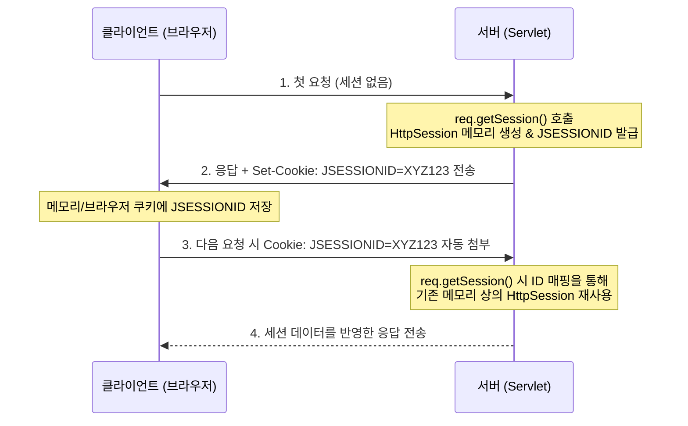

# Step 2: 세션 (Session) 개념 및 원리 정리

본 문서는 [SessionServlet.java](file:///Users/morgan/Documents/workspace/cookiesession/src/main/java/com/example/cookiesession/step2/SessionServlet.java), [DTO.java](file:///Users/morgan/Documents/workspace/cookiesession/src/main/java/com/example/cookiesession/step2/DTO.java), 그리고 [session.jsp](file:///Users/morgan/Documents/workspace/cookiesession/src/main/webapp/WEB-INF/views/step02/session.jsp) 코드를 기반으로 세션의 기본 동작 방식, 핵심 API, 그리고 웹 보안 및 대규모 환경을 고려한 면접 질문을 정리한 문서입니다.

---

## 1. 초보자를 위한 비유

### 🔑 세션(Session)이란 무엇일까요?
세션은 헬스장(서버)의 **개인 사물함(락커룸)**과 같습니다.

쿠키 방식에서는 회원(클라이언트)이 운동복, 운동화, 회원권(모든 데이터)을 매번 본인 가방에 무겁게 직접 들고 다녀야 했습니다.  
반면 세션 방식에서는 헬스장에 개인 사물함(세션)을 하나 분배받고, 내 물건(DTO 등 중요 데이터)은 사물함 안에 안전하게 넣어둡니다.  
그리고 내 손목에는 이 사물함을 열 수 있는 **사물함 번호 열쇠고리(JSESSIONID)** 하나만 차고 다니는 것입니다.

* **체크인**: 헬스장에 입장하며 손목의 열쇠고리(쿠키에 담긴 Session ID)를 보여주면, 직원은 번호를 확인해 내 개인 사물함을 열어줍니다.
* **보안성**: 다른 손님들은 내 열쇠고리 번호만 보고서는 사물함 안에 무엇이 들어있는지 알 수 없습니다.

### 🔍 설정 속성 및 API의 비유
* **`req.getSession(true)`**: 헬스장에 처음 온 손님에게 새로운 사물함을 배정하고 열쇠를 주는 것입니다. (또는 기존 열쇠가 있으면 사물함을 그대로 쓰게 함)
* **`req.getSession(false)`**: 열쇠가 없는 상태에서 입장하려는 손님에게 사물함을 새로 내주지 않고 그냥 돌려보내는 것입니다 (`null` 반환).
* **`session.invalidate()`**: 헬스장 회원권 만료 및 사물함 이용 계약을 정식 해지하여 사물함을 비우고 열쇠를 반납하는 과정입니다.
* **`session.setAttribute("dto", DTO)`**: 사물함 안에 내 귀중품 상자(DTO)를 보관하는 과정입니다.
* **`session.getAttribute("dto")`**: 사물함에서 내 귀중품 상자를 꺼내오는 것입니다. 이때 상자는 일반적인 '보관 상자(Object)' 모양이므로, 내 내용물을 원래 규격에 맞춰 사용하려면 원래 내 가방(DTO) 형태로 알맞게 확인하는 과정(**다운캐스팅**)이 필요합니다.

---

## 2. 주니어를 위한 원리 설명

### 🔄 세션의 메커니즘과 생명주기
세션은 서버가 클라이언트의 상태를 기억하기 위해 **서버 측 메모리에 상태 정보를 유지**하는 기술입니다. 단, 클라이언트와의 매핑을 위해 클라이언트측 웹 브라우저 쿠키인 `JSESSIONID`를 이용합니다.



### ⚙️ 핵심 API 및 코드 동작 원리

[SessionServlet.java](file:///Users/morgan/Documents/workspace/cookiesession/src/main/java/com/example/cookiesession/step2/SessionServlet.java) 코드에서의 세션 제어 방식은 다음과 같습니다.

1. **세션 획득 옵션**
    * `req.getSession()` 또는 `req.getSession(true)` (기본값):  
      요청 헤더의 `JSESSIONID`와 매칭되는 세션이 있으면 기존 세션을 반환하고, 없으면 새로운 `HttpSession` 객체를 서버 메모리에 생성한 뒤 반환합니다.
    * `req.getSession(false)`:  
      요청에 바인딩된 기존 세션이 있으면 그대로 가져오지만, 없거나 만료된 상태라면 새로 생성하지 않고 `null`을 반환합니다. 불필요한 메모리 소모를 방지할 때 사용합니다.

2. **세션 데이터 보관 및 조회 (`Attribute`)**
   ```java
   session.setAttribute("dto", new DTO("my-dto", 1));
   ```
    * 세션은 Key-Value 맵 형태로 작동합니다. 값으로 들어가는 모든 자바 객체는 다형성에 의해 `Object` 타입으로 저장(**Upcasting**)됩니다.
   ```java
   DTO dto = (DTO) session.getAttribute("dto");
   ```
    * 세션에서 객체를 다시 꺼내와 비즈니스 메서드나 레코드의 Getter 등을 활용하려면 `Object` 타입을 원래의 타입인 `DTO`로 강제 형변환(**Downcasting**)해주어야 합니다.

3. **세션 무효화 (`invalidate`)**
   ```java
   session.invalidate();
   ```
    * 서버 메모리 상의 세션 객체를 즉시 강제로 소멸시킵니다. 로그인 만료나 로그아웃 처리를 수행할 때 사용됩니다.

4. **JSP/EL과의 연동 (`sessionScope`)**
    * [session.jsp](file:///Users/morgan/Documents/workspace/cookiesession/src/main/webapp/WEB-INF/views/step02/session.jsp) 파일에서는 `${data}` 및 `${dto}` 표현식을 사용해 출력합니다.
    * 서블릿에서 보관한 데이터는 JSP의 내장 객체인 `sessionScope` 영역에 우선적으로 바인딩되어 있으며, EL 표현식이 실행될 때 자동으로 스코프 탐색 과정을 거쳐 값을 렌더링하게 됩니다.

---

## 3. 면접을 위한 예상 질문 및 모범 답변

### Q1. `req.getSession(true)`와 `req.getSession(false)`의 동작 방식 차이와 각각의 유스케이스를 설명해 주세요.
> **모범 답변:**  
> `req.getSession(true)`(또는 기본 생략형)는 요청 헤더에 실려온 `JSESSIONID`를 기반으로 대응되는 세션이 존재하면 해당 세션을 반환하고, 세션이 존재하지 않거나 만료되었을 경우 서버가 메모리에 새로운 `HttpSession` 객체를 새로 생성하여 반환합니다. 주로 로그인 처리, 회원 가입 시 세션 할당 등 세션 데이터를 필히 신규 할당해야 하는 기능에 쓰입니다.  
> 반면, `req.getSession(false)`는 세션이 존재할 때만 반환하고, 세션이 없다면 새로 생성하지 않고 `null`을 반환합니다. 이 옵션은 단순히 현재 유저가 로그인 상태인지 확인만 하는 인증 체크 인터셉터/필터 환경이나, 읽기 전용 리소스를 제공할 때 불필요하게 신규 세션이 무분별하게 발행되는 현상을 막아 서버 메모리 낭비를 줄이는 데 활용됩니다.

### Q2. 세션의 setAttribute 및 getAttribute 활용 시 자바의 업캐스팅과 다운캐스팅이 어떻게 작동하며, 이때 발생할 수 있는 잠재적 에러와 방어 코드는 어떻게 작성하나요?
> **모범 답변:**  
> `HttpSession.setAttribute` 메서드는 모든 자바 객체를 저장할 수 있도록 매개변수 타입이 `Object`로 선언되어 있습니다. 이로 인해 세션에 저장할 때 자동 **업캐스팅(Upcasting)**이 발생합니다. 반대로 `getAttribute`를 통해 데이터를 조회할 때 역시 `Object` 타입으로 반환하므로, 객체의 고유 멤버와 메서드에 접근하기 위해서는 명시적으로 타입 변환을 하는 **다운캐스팅(Downcasting)**을 거쳐야 합니다.  
> 이때 발생할 수 있는 주요 에러는 다음과 같습니다:
> 1. **`NullPointerException`**: 세션에 해당 키의 데이터가 없거나 세션 자체가 끊겨 `getAttribute` 결과가 `null`일 때, 체크 없이 바로 멤버를 호출하는 경우 발생합니다.
> 2. **`ClassCastException`**: 세션에 실제로 저장된 객체의 타입과 다운캐스팅하려는 변수의 타입이 불일치할 때 발생합니다.
     > 이를 방어하기 위해 다운캐스팅 전에 항상 `null` 여부를 검증하고, 유동적인 타입인 경우 `instanceof` 키워드를 사용하여 사전에 호환성을 체크한 후 형변환을 안전하게 수행해야 합니다.

### Q3. 대규모 트래픽 및 동시 접속 환경에서 웹 서버(WAS) 내장 세션을 단독으로 사용할 때 발생할 수 있는 병목 현상 및 동기화 이슈는 무엇이며, 이를 프로덕션 수준에서 어떻게 해결하나요?
> **모범 답변:**  
> 기본 내장 세션은 각 WAS 프로세스의 JVM 메모리(Heap Area)에 상태를 보존합니다. 이로 인해 다음과 같은 세 가지 문제가 발생할 수 있습니다:
> 1. **메모리 고갈 및 GC 부하:** 동시 접속자가 많아지면 세션 인스턴스가 늘어나 JVM Heap 메모리를 차지하게 되고, 이로 인해 자주 가비지 컬렉션(GC)이 발생하여 서버 전체가 일시 정지(Stop-the-world)되거나 OOM 에러가 납니다.
> 2. **세션 정합성(Session Consistency) 상실:** 로드 밸런서를 통해 트래픽 분산 처리를 하는 다중 WAS 환경에서, 최초 A 서버에서 로그인되어 세션이 생성된 사용자가 다음 API 요청 시 B 서버로 분산 처리되면 로그인이 풀려버리는 문제가 생깁니다.
>
> 이를 해결하기 위해 프로덕션 환경에서는 다음과 같은 전략을 사용합니다:
> * **세션 타임아웃 최소화**: 30분 등의 합리적인 유휴 시간을 설정하여 방치된 세션을 빠르게 정리합니다.
> * **Sticky Session 설정**: 로드 밸런서에서 최초 세션이 발급된 특정 WAS로만 동일 클라이언트의 트래픽을 몰아주도록 쿠키 기반 매칭을 수행합니다. (다만 특정 서버 부하 집중 및 장애 전파 시 세션 소실 단점이 존재합니다)
> * **세션 클러스터링 (Session Clustering)**: WAS들 간에 세션 상태를 실시간 동기화 복제(Replication)합니다. (네트워크 트래픽 오버헤드 주의)
> * **인메모리 외부 세션 저장소 도입 (Stateless 아키텍처)**: Redis나 Memcached 같은 고성능 캐시/메모리 DB를 중앙 외장 세션 저장소로 활용하여, WAS 자체는 아무 상태도 가지지 않도록 설계합니다. 이 방법이 확장성(Scale-out)과 안정성 면에서 가장 권장됩니다.

### Q4. 만약 클라이언트 브라우저가 쿠키 수신을 거부(비활성화)하면 세션 추적이 불가능해집니다. 이 경우 세션을 유지하기 위한 Servlet 스펙상의 대안은 무엇인가요?
> **모범 답변:**  
> 클라이언트 측에서 쿠키 사용을 원천 비활성화하면 응답 헤더로 전달한 `JSESSIONID` 쿠키를 무시하므로 다음 요청 시 세션 ID를 식별하지 못합니다. 이를 우회하기 위해 서블릿 스펙은 **URL 재작성(URL Rewriting)** 기술을 제공합니다.  
> 모든 하이퍼링크 및 액션 URL 경로 뒤에 세션 식별자를 세미콜론과 함께 포함시켜 전달하는 방식입니다. (예: `/session;jsessionid=XYZ12345`)  
> 자바 서블릿 코드 단에서는 `response.encodeURL("URL경로")` 메서드를 감싸 호출하면, 컨테이너가 클라이언트 브라우저의 쿠키 지원 여부를 실시간 탐지하여 쿠키가 차단된 상태일 때 자동으로 URL 뒤에 `;jsessionid=...` 값을 덧붙여줍니다. 다만 URL 경로에 고유 식별자가 투명하게 표출되므로 보안 탈취 위협이 매우 커 현대 프로덕션 환경에서는 권장되지 않습니다.