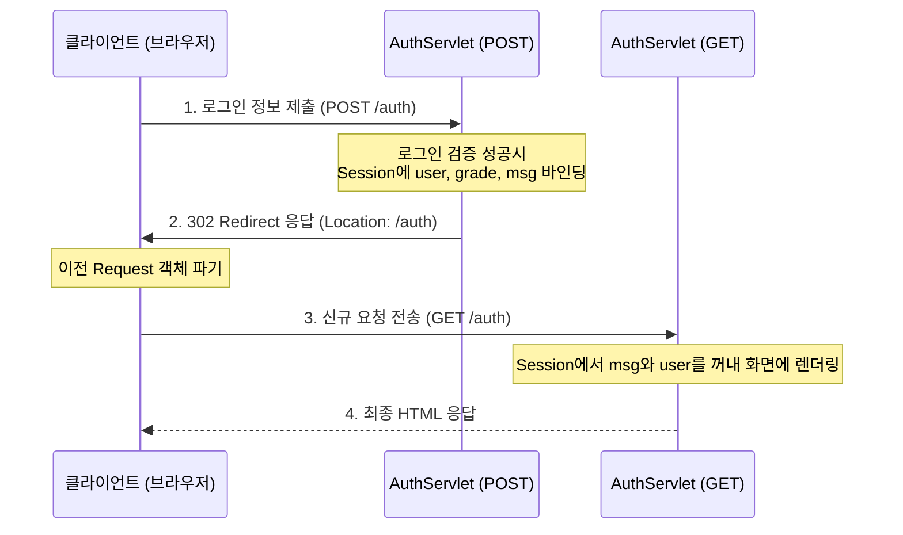

# Step 3: 세션 기반 인증 및 인가 권한 설정 정리

본 문서는 [AuthServlet.java](file:///Users/morgan/Documents/workspace/cookiesession/src/main/java/com/example/cookiesession/step3/AuthServlet.java), [FreeServlet.java](file:///Users/morgan/Documents/workspace/cookiesession/src/main/java/com/example/cookiesession/step3/FreeServlet.java), [PremiumServlet.java](file:///Users/morgan/Documents/workspace/cookiesession/src/main/java/com/example/cookiesession/step3/PremiumServlet.java), 그리고 [auth.jsp](file:///Users/morgan/Documents/workspace/cookiesession/src/main/webapp/WEB-INF/views/step03/auth.jsp) 코드를 기반으로 세션을 활용한 회원 인증(Authentication) 및 인가(Authorization), 그리고 리다이렉트 시 메시지 전달 패턴을 정리한 문서입니다.

---

## 1. 초보자를 위한 비유

### 🎡 로그인 및 등급 권한(Role-based Authorization)의 비유
이 시스템은 놀이공원(웹 서비스)과 보안 구역의 동작과 똑같습니다.

1. **입장 매표소 (`AuthServlet`)**
    * 손님이 입구에서 ID(아이디)와 PW(비밀번호)를 보여줍니다. 통과되면 직원은 손님 전용 사물함(세션)을 하나 개설하고, 사물함의 상태 정보에 손님의 등급(`grade`: 일반 또는 프리미엄)과 이름(`user`)을 기록한 뒤 손목 띠(열쇠고리)를 채워 돌려보냅니다.
2. **무료/일반 체험 구역 (`FreeServlet`)**
    * 입구 경비원이 손님의 손목 띠를 읽어 사물함에 이름(`user`) 정보가 적혀있는지 확인합니다. 등록된 회원 정보만 확인되면 바로 입장시키지만, 로그인하지 않은(손목 띠가 없는) 일반 행인은 입구(매표소 `/auth`)로 쫓아냅니다.
3. **VIP/프리미엄 구역 (`PremiumServlet`)**
    * 이 구역 경비원은 확인 절차가 까다롭습니다. 회원 이름(`user`)이 있는지 확인할 뿐만 아니라, 사물함의 등급표(`grade`)가 `premium`으로 되어 있는지 대조합니다. 만약 일반(`free`) 등급 회원인 경우 "돈을 더 내세요"라는 경고 쪽지(`msg`)를 사물함에 적어두고 마찬가지로 매표소(`/auth`)로 돌려보냅니다.

### ✉️ 리다이렉션 (`sendRedirect`)과 세션 쪽지함의 비유
매표소에서 회원가입을 마치고 직원이 손님에게 "로그인 성공!"이라고 적힌 안내 쪽지(`msg`)를 손님 옷자락(Request Scope)에 붙여주면서 문 밖으로 나가 다른 통로로 재입장하라고 밀어냅니다 (Redirect).
* 이 경우 손님이 밖으로 나갔다가 다시 다른 쪽 입구로 들어오는 사이, 바람에 날려 옷자락에 붙은 쪽지(Request Attribute)는 소멸됩니다.
* 그렇기 때문에 직원은 안내 쪽지를 날아가지 않게 손님의 **개인 사물함(Session Scope)**에 대신 넣어두는 것입니다. 재입장한 손님이 사물함 문을 열어 쪽지를 확인할 수 있게 하기 위해서입니다.

---

## 2. 주니어를 위한 원리 설명

### 🔄 POST-Redirect-GET (PRG) 패턴
로그인(POST) 완료 후 JSP 화면으로 포워딩하지 않고 `resp.sendRedirect("/auth")`를 호출하는 이유는 브라우저의 오작동 및 새로고침(F5) 오류를 방지하기 위함입니다.
* 만약 POST 요청 후 바로 JSP 화면을 렌더링하면, 사용자가 브라우저에서 '새로고침'을 누를 때마다 마지막 전송 방식인 **POST 요청(로그인 폼 전송)이 계속 재요청**되어 동일 작업이 중복 실행됩니다.
* **PRG 패턴**은 리다이렉션을 거치게 함으로써 브라우저의 최종 히스토리 주소를 안전한 GET 방식의 주소(`/auth`)로 바꾸어 줍니다. 이제 새로고침을 하더라도 단순 조회용 GET 요청만 호출되므로 안전합니다.



### ⚙️ Forward vs Redirect의 요청 수명 차이
* **Forward (포워딩)**
    * WAS 서버 내부에서 서블릿과 JSP 간에 제어권만 위임하는 방식입니다. 클라이언트는 이 과정이 일어났는지 인지하지 못합니다. (URL 주소창 변경 없음)
    * 요청과 응답 객체(`req`, `resp`)가 그대로 공유되므로 `req.setAttribute()`에 담은 데이터를 JSP에서 자유롭게 조회할 수 있습니다.
* **Redirect (리다이렉션)**
    * 클라이언트에게 `302 Found` 응답을 보내 다른 URL로 다시 접속하라고 브라우저에 명령합니다. (URL 주소창 변경됨)
    * 브라우저가 완전히 독립된 새로운 HTTP 요청을 날리기 때문에 이전 요청 객체(`req`)는 즉시 소멸합니다. 따라서 `req.setAttribute()` 값도 유실됩니다.
    * 리다이렉트 흐름에서도 일회성 안내 메시지를 온전히 전달하기 위해 **`HttpSession` 객체(Session Scope)**에 데이터를 임시 적재한 뒤 꺼내 쓰도록 설계해야 합니다.

### 🛡️ 역할 기반의 세션 필터링
[FreeServlet.java](file:///Users/morgan/Documents/workspace/cookiesession/src/main/java/com/example/cookiesession/step3/FreeServlet.java)와 [PremiumServlet.java](file:///Users/morgan/Documents/workspace/cookiesession/src/main/java/com/example/cookiesession/step3/PremiumServlet.java)는 각각 인가 처리를 다음과 같이 구현합니다.

* **인증 필터링 (Authentication)**
  ```java
  if (session.getAttribute("user") == null) {
      resp.sendRedirect("/auth");
      return;
  }
  ```
* **권한 등급 필터링 (Authorization)**
  ```java
  if (!session.getAttribute("grade").equals("premium")) {
      session.setAttribute("msg", "돈을 내세요");
      resp.sendRedirect("/auth");
      return;
  }
  ```

---

## 3. 면접을 위한 예상 질문 및 모범 답변

### Q1. POST-Redirect-GET(PRG) 패턴의 정의와 이것이 해결하는 핵심 문제에 대해 설명해 주세요.
> **모범 답변:**  
> PRG 패턴은 클라이언트가 서버로 CUD(등록/수정/삭제) 같은 POST 요청을 보낸 뒤, 서버가 처리를 마친 후 응답 헤더의 `Location`을 통해 다른 안전한 GET 경로로 클라이언트를 강제 이동(Redirect)시키는 디자인 패턴입니다.  
> 만약 PRG 패턴을 적용하지 않고 POST 요청의 처리 결과를 직접 포워딩하여 뷰로 렌더링하면, 사용자가 해당 결과 페이지에서 브라우저 '새로고침(F5)'을 누를 시 직전에 실행했던 POST 요청이 다시 중복해서 전송됩니다. 이로 인해 전자상거래 사이트 등에서 **동일 상품이 중복 결제**되거나 게시물이 여러 번 쓰여지는 등 심각한 중복 데이터 처리가 발생할 위험이 있습니다. PRG 패턴은 새로고침 시 단순 조회 목적의 GET 요청만 반복되도록 히스토리를 강제하여 데이터 정합성 오류를 원천 차단합니다.

### Q2. 포워드(Forward)와 리다이렉트(Redirect) 수행 시 Request 스코프에 바인딩된 데이터의 생존 여부가 다른 이유를 서블릿 동작 원리와 엮어 비교 설명해 주세요.
> **모범 답변:**  
> 두 방식은 클라이언트가 새로운 요청 주기를 유발하는지 여부에 따라 생명주기가 갈립니다.
> * **포워드(Forward)**는 서버(WAS) 내에서 제어 흐름이 서블릿에서 JSP 등으로 내부 포워딩되는 방식입니다. 클라이언트는 서버 내부의 이동 과정을 인지하지 못하며, 클라이언트의 최초 요청부터 응답까지 단 **1번의 Request Cycle(요청/응답 주기)**로 동작합니다. 따라서 동일한 `HttpServletRequest` 객체가 공유되므로 `req.setAttribute`로 담은 데이터가 유지됩니다.
> * **리다이렉트(Redirect)**는 서버가 클라이언트에게 `302 Found` 상태 코드와 새로운 경로 주소를 담은 `Location` 헤더를 전송하여 클라이언트가 그 주소로 새로운 HTTP 요청을 전송하게 유도합니다. 즉, **2번의 Request Cycle**이 발생하게 되며 첫 번째 요청 응답 주기가 끝나는 즉시 첫 번째 `HttpServletRequest` 객체는 소멸되고 두 번째 요청에서 새로운 객체가 생성됩니다. 따라서 첫 번째 요청에 보관했던 `req.setAttribute` 데이터는 유실되며, 이를 유지하기 위해선 세션이나 URL 파라미터를 사용해 데이터를 명시적으로 실어 보내야 합니다.

### Q3. 개별 컨트롤러/서블릿단(FreeServlet, PremiumServlet)에서 매번 중복하여 세션 로그인 여부 및 권한 체크 처리를 직접 작성할 때 발생하는 한계점과 이를 구조적으로 개선하는 방안을 설명해 주세요.
> **모범 답변:**  
> 개별 서블릿 마다 매번 세션을 꺼내고 세션 ID 유무 및 권한 속성(`grade`)을 체크하는 코드를 물리적으로 삽입하는 방식은 **공통 관심사(Cross-Cutting Concern)** 분리가 되지 않은 대표적인 안티 패턴입니다. 검증 대상이 되는 주소(URL)가 늘어날 때마다 코드가 중복되고 누락의 위험이 존재하여 유지보수성 및 보안성이 극도로 저하됩니다.  
> 이를 개선하기 위해 다음과 같은 공통 제어 기술을 도입해야 합니다:
> 1. **서블릿 필터 (Servlet Filter)**: 서블릿 스펙에서 제공하는 `Filter`를 구현하여 요청이 목표 서블릿에 닿기 전에 미리 가로채어 세션 검증 및 인가 처리를 일괄 적용합니다.
> 2. **스프링 인터셉터 (Spring HandlerInterceptor)**: 스프링 환경에서 컨트롤러 단의 진입 전/후에 인가 로직을 인터셉터로 분리하여 어노테이션이나 URL 패턴 매칭을 통해 공통 모듈화합니다.
> 3. **스프링 시큐리티 (Spring Security)**: 필터 체인 기반의 보안 프레임워크를 적용하여 URI별 접근 통제(`hasRole()`, `authenticated()`)를 구성 파일에서 선언적으로 중앙 집중 관리함으로써 안전성과 확장성을 높입니다.

### Q4. 세션 기반 메시지 전달(예: `session.setAttribute("msg", "돈을 내세요")`) 시, 1회성으로 알림이 출력된 이후에도 새로고침 시 반복 노출될 수 있는 오작동 문제를 어떻게 해결할 수 있나요?
> **모범 답변:**  
> 세션 스토리지에 한 번 등록된 데이터는 명시적으로 지우거나 세션이 만료되기 전까지 지속적으로 서버 메모리에 보관됩니다. 이 때문에 JSP 등의 뷰 페이지가 렌더링된 이후에도 `"msg"`가 남아있어, 사용자가 페이지를 새로고침하거나 다른 페이지로 넘어갔을 때 동일한 팝업/안내가 오작동으로 반복 노출되는 현상이 생깁니다.  
> 이를 해결하기 위해 다음과 같은 방식을 사용해야 합니다:
> 1. **수동 삭제**: JSP 또는 뷰 컨트롤러 단에서 메시지를 조회하여 출력하자마자 즉시 `session.removeAttribute("msg")` 메서드를 호출해 메모리에서 제거하도록 구성합니다.
> 2. **스프링 FlashAttribute 활용**: 스프링 MVC를 사용하는 경우 `RedirectAttributes.addFlashAttribute(key, value)` 기능을 사용합니다. 이 데이터는 내부적으로 임시 세션 영역에 등록된 후, 리다이렉트되어 오는 다음 요청 렌더링 시 단 한 번만 조회되고 스프링 프레임워크가 자동으로 세션에서 소멸시켜 주므로 오작동을 완벽히 방지할 수 있습니다.