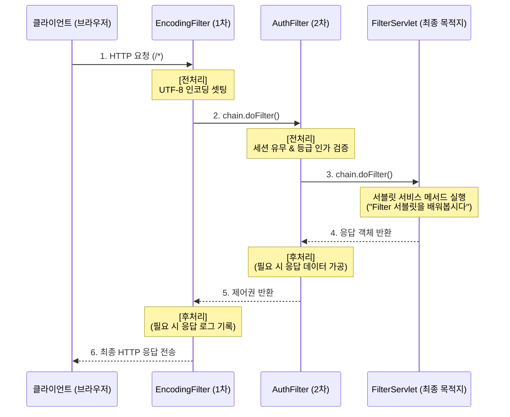

# Step 4: 서블릿 필터 (Servlet Filter) 개념 및 원리 정리

본 문서는 [EncodingFilter.java](file:///Users/morgan/Documents/workspace/cookiesession/src/main/java/com/example/cookiesession/step4/EncodingFilter.java), [AuthFilter.java](file:///Users/morgan/Documents/workspace/cookiesession/src/main/java/com/example/cookiesession/step4/AuthFilter.java), 그리고 [FilterServlet.java](file:///Users/morgan/Documents/workspace/cookiesession/src/main/java/com/example/cookiesession/step4/FilterServlet.java) 코드를 기반으로 서블릿 필터의 핵심 개념, 필터 체인(Filter Chain)의 동작 원리, 전처리/후처리 흐름 및 면접 질문을 정리한 문서입니다.

---

## 1. 초보자를 위한 비유

### 👮 서블릿 필터(Servlet Filter)란 무엇일까요?
필터는 놀이공원 입구에 설치된 **보안 검색대** 및 **안내소**와 같습니다.

개별 부스(서블릿)에 입장하기 전, 모든 방문객(HTTP 요청)은 반드시 공통 관문인 입구 검색대(필터)를 먼저 통과해야만 합니다.

* **인코딩 필터 (`EncodingFilter`)**
    * 입구 안내소에서 모든 입장객의 가방에 "한국어 규격 배지"를 부착해주는 요원입니다. 손님이 어떤 부스에 가든 미리 일관되게 규격(`UTF-8`)을 맞춰 주는 전처리 역할을 담당합니다.
* **인증/인가 필터 (`AuthFilter`)**
    * 특정 체험존 구역(`/filter/*`)에 들어가려는 손님들의 손목 띠(세션)를 엄격히 검사하는 보안요원입니다.
    * 손목 띠가 없는(로그인 안 한) 손님은 매표소(`/auth`)로 강제 퇴장시킵니다.
    * 프리미엄 전용 체험관(`premium`)에 가려는 손님의 사물함 등급 정보가 일반(`free`)이면 마찬가지로 매표소로 돌려보냅니다.

### ⛓️ 필터 체인 (`FilterChain.doFilter`)의 비유
보안 검색 요원이 확인을 완료한 후, 손님을 다음 검색대(다른 필터)로 넘겨주거나 최종 목적지 체험관(서블릿)으로 가도록 길을 터주는 문지기입니다.
* 만약 요원이 "다음 구역으로 가세요"라고 인도(**`chain.doFilter(request, response)`**)해주지 않으면, 손님은 검색대에 갇혀 꼼짝달싹 못 하게 됩니다 (브라우저 먹통 현상 유발).

---

## 2. 주니어를 위한 원리 설명

### 🔄 필터의 아키텍처 및 전처리/후처리 흐름
필터는 요청이 최종 목적지인 서블릿(Servlet)에 닿기 전, 그리고 서블릿의 비즈니스 로직이 처리되고 난 후 클라이언트로 응답이 가기 전 양방향에서 개입할 수 있습니다.



### ⚙️ 핵심 구현 원리 및 API

1. **필터 인터페이스의 3대 메서드**
    * **`init(FilterConfig)`**: 서블릿 컨테이너(톰캣 등)가 기동 시 필터를 싱글톤 인스턴스로 생성하고 초기화하기 위해 최초 딱 1번 호출합니다.
    * **`doFilter(ServletRequest, ServletResponse, FilterChain)`**: 클라이언트가 매핑된 URL로 요청을 보낼 때마다 가로채어 실행되는 핵심 비즈니스 로직 영역입니다.
    * **`destroy()`**: 웹 애플리케이션 종료 또는 컨테이너 리로드 시 필터 객체를 영구 소멸시키며 자원을 해제합니다.

2. **HTTP 전용 요청/응답 객체 다운캐스팅**
   ```java
   HttpServletRequest req = (HttpServletRequest) request;
   HttpServletResponse resp = (HttpServletResponse) response;
   ```
    * `doFilter`가 매개변수로 받는 `ServletRequest` 및 `ServletResponse`는 다양한 통신 프로토콜을 포괄하기 위한 최상위 스펙입니다.
    * 따라서 웹 브라우저의 HTTP URI 경로 추적(`getRequestURI()`), HTTP 세션 호출(`getSession()`), 리다이렉트 처리(`sendRedirect()`) 등을 다루기 위해 자식 인터페이스인 `HttpServlet` 관련 타입으로 **명시적 형변환(Downcasting)**을 거쳐야 합니다.

3. **요청 체인의 연계 (`chain.doFilter`)**
   ```java
   chain.doFilter(request, response);
   ```
    * 이 메서드가 호출되는 시점에 요청 흐름은 다음 등록된 필터로 제어가 위임되며, 마지막 필터인 경우 최종 서블릿으로 전송됩니다.
    * **흐름의 전처리/후처리 구분**: `chain.doFilter`가 호출되기 **이전**에 쓴 코드는 전처리가 되고, 호출된 **이후**에 적힌 코드는 서블릿이 모든 일을 처리하고 응답을 만들어 돌려줄 때 적용되는 후처리 코드가 됩니다.

---

## 3. 면접을 위한 예상 질문 및 모범 답변

### Q1. 서블릿 필터(Servlet Filter)의 기능과 라이프사이클(init, doFilter, destroy)의 실행 시점에 대해 상세히 설명해 주세요.
> **모범 답변:**  
> 서블릿 필터는 클라이언트의 HTTP 요청이 웹 애플리케이션의 최종 타겟 서블릿에 도달하기 전 또는 서블릿이 생성한 응답을 클라이언트에 돌려주기 전에 공통 관심사를 처리하는 구성 요소입니다.  
> 필터의 라이프사이클은 서블릿 컨테이너(WAS)에 의해 다음과 같이 제어됩니다:
> 1. **`init()`**: 컨테이너가 시작될 때 또는 웹 애플리케이션이 배포될 때 단 1회 호출되어 필터 인스턴스를 초기화합니다.
> 2. **`doFilter()`**: 매핑된 URL 패스에 해당하는 요청이 들어올 때마다 호출되어 전처리 및 후처리 비즈니스 로직을 매번 수행합니다.
> 3. **`destroy()`**: 웹 애플리케이션이 종료되거나 필터 인스턴스가 소멸되는 시점에 컨테이너에 의해 1회 호출되어, 필터가 점유하고 있던 자원(메모리 등)을 정리합니다.

### Q2. 필터 내부에서 `chain.doFilter(request, response)` 호출이 누락될 경우 어떤 치명적인 오류가 발생하며, 그 이유는 무엇인가요?
> **모범 답변:**  
> `chain.doFilter()`는 서블릿 컨테이너가 관리하는 여러 개의 필터 체인(Filter Chain) 중 다음 단계에 위치한 필터 또는 최종 서블릿(Servlet)에게 요청과 응답을 넘겨주는 열쇠 역할을 합니다.  
> 만약 이 메서드 호출이 로직 내부에서 누락되거나 에러로 끊길 경우, 요청 흐름이 더 이상 다음 단계로 진행되지 못하고 해당 필터단에서 완전히 멈춰버립니다. 이로 인해 브라우저(클라이언트)는 아무런 데이터도 응답받지 못하는 무한 대기 상태(Pending) 또는 화이트라벨 에러 페이지를 마주하게 되는 매우 치명적인 장애를 유발합니다. 따라서 비인가 사용자를 의도적으로 리다이렉트하는 예외 분기가 아니라면, 흐름을 끊지 않도록 반드시 `chain.doFilter`를 수행해 주어야 합니다.

### Q3. `ServletRequest` 타입을 `HttpServletRequest`로 형변환(Downcasting)하여 사용하는 근본적인 이유가 무엇인지 서블릿 스펙의 설계 관점에서 설명해 주세요.
> **모범 답변:**  
> 서블릿 명세서(Servlet Specification)는 본래 HTTP 프로토콜뿐만 아니라 FTP, SMTP 등 다양한 전송 프로토콜에 범용적으로 대응할 수 있도록 상위 수준에서 독립적으로 추상화하여 설계되었습니다. 이에 따라 `Filter`의 `doFilter` 메서드 역시 일반 프로토콜 통신을 수용하기 위해 매개변수 타입이 최상위인 `ServletRequest` 및 `ServletResponse`로 규정되어 있습니다.  
> 하지만 우리가 구축하는 대다수의 웹 애플리케이션은 **HTTP 프로토콜**을 기반으로 통신하므로 HTTP 전용 속성(URI 파싱, 쿠키 획득, HTTP 세션 바인딩, 리다이렉트 처리 등)을 반드시 활용해야 합니다. 따라서 이 기능들이 확장되어 재정의된 자식 인터페이스인 `HttpServletRequest`와 `HttpServletResponse` 타입으로의 명시적 다운캐스팅이 불가피합니다.

### Q4. 서블릿 필터(Servlet Filter)와 스프링 인터셉터(Spring Interceptor)의 아키텍처적 차이점과 공통 작업을 분배할 때의 적절한 기준을 설명해 주세요.
> **모범 답변:**  
> 둘의 가장 큰 아키텍처적 차이는 **동작하는 컨텍스트(컨테이너)의 위치**입니다.
> * **서블릿 필터**는 스프링 프레임워크의 외부인 **서블릿 컨테이너(톰캣 등) 레벨**에서 실행됩니다. 스프링의 `DispatcherServlet`에 닿기도 전에 먼저 동작하므로 웹 애플리케이션의 로우레벨 처리에 적합합니다. (예: 인코딩 필터링, 이미지 핫링크 차단, XSS 방어 등 웹 전반의 공통 정책)
> * **스프링 인터셉터**는 스프링 MVC의 `DispatcherServlet`과 컨트롤러 사이인 **스프링 컨텍스트 내부**에서 실행됩니다. 스프링 내의 모든 빈(Bean) 객체에 쉽게 주입되어 상호작용할 수 있고, 요청을 처리할 대상 컨트롤러 핸들러와 메서드의 아노테이션/타입 정보를 정교하게 취득할 수 있습니다. (예: 컨트롤러 메서드 실행 시간 측정, 세밀한 비즈니스 권한 인가 체크 등)  
    > 따라서 인프라성/인코딩/보안 기본 게이트웨이 작업은 **필터**에, 비즈니스 지향적이고 스프링 빈 협업이 적극 필요한 공통 로직은 **인터셉터**에 배치하는 것이 올바른 기준입니다.