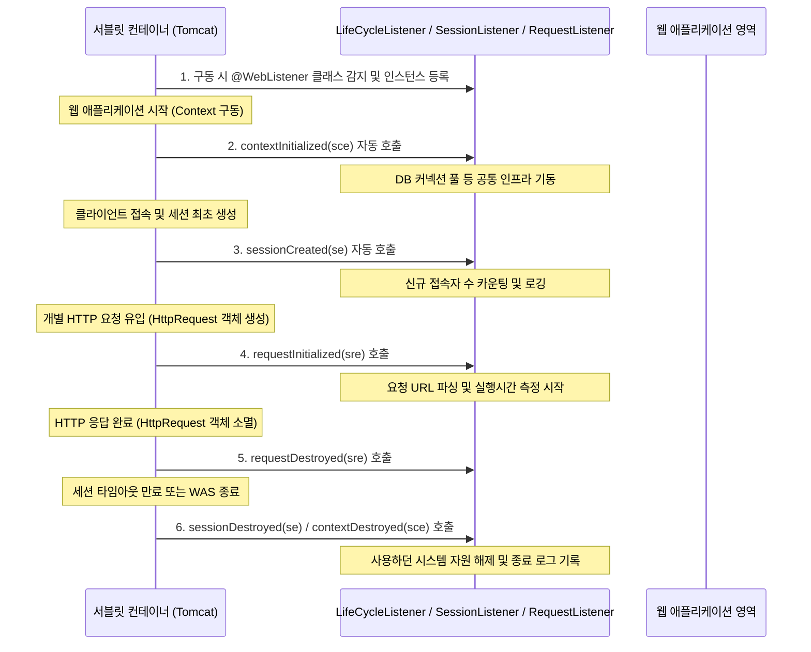

# Step 5: 서블릿 리스너 (Servlet Listener) 개념 및 원리 정리

본 문서는 [LifeCycleListener.java](file:///Users/morgan/Documents/workspace/cookiesession/src/main/java/com/example/cookiesession/step5/LifeCycleListener.java), [SessionListener.java](file:///Users/morgan/Documents/workspace/cookiesession/src/main/java/com/example/cookiesession/step5/SessionListener.java), 그리고 [RequestListener.java](file:///Users/morgan/Documents/workspace/cookiesession/src/main/java/com/example/cookiesession/step5/RequestListener.java) 코드를 기반으로 서블릿 리스너의 개념, 옵저버 패턴과의 관계, 주요 리스너의 생명주기 및 면접 예상 질문을 정리한 문서입니다.

---

## 1. 초보자를 위한 비유

### 🚨 서블릿 리스너(Servlet Listener)란 무엇일까요?
리스너는 웹 서버 안에서 일어나는 특정 사건(이벤트)을 감시하다가, 사건이 터지면 비상벨을 울리거나 정해진 행동을 바로 처리해주는 **자동 감지 센서** 및 **CCTV 알림봇**과 같습니다.

* **필터(Filter)**: 입구 길목을 지키고 서서 손님을 직접 검사하고 통제하는 "보안 요원"
* **리스너(Listener)**: 뒤에서 묵묵히 관찰하다가 "개장함", "폐장함", "세션 생김", "요청 들어옴" 등의 신호가 오면 즉시 연결된 기능을 작동시키는 "자동 감지기"

### 🔍 주요 리스너들의 비유
1. **애플리케이션 수명 감지기 (`ServletContextListener` -> `LifeCycleListener`)**
    * 놀이공원(웹 애플리케이션)의 **개장(`contextInitialized`)과 폐장(`contextDestroyed`)**을 감지하는 메인 전원 스위치 센서입니다.
    * 놀이공원이 개장하자마자 분수대를 켜고 시설을 기동하며(자원 초기화), 밤이 되어 폐장할 때 남은 전기와 자원을 모두 끄고 정리하는(자원 해제) 자동 제어 장치입니다.
2. **세션 수명 감지기 (`HttpSessionListener` -> `SessionListener`)**
    * 놀이공원 내 **개인 사물함(세션)이 새로 개설되거나(`sessionCreated`) 반납/파기될 때(`sessionDestroyed`)** 작동하는 센서입니다.
    * 새로운 손님이 사물함을 배정받을 때 "사물함 개설 완료! (ID: XYZ...)"라고 장부에 기록을 남겨주고, 손님이 오랫동안 부스를 비워 사물함이 강제 자동 반납될 때도 이를 즉시 기록해 줍니다.
3. **요청 수명 감지기 (`ServletRequestListener` -> `RequestListener`)**
    * 각 개별 부스(체험관) 입구에 설치된 **입장객 회전 게이트 센서**와 같습니다.
    * 한 명의 손님이 들어올 때(`requestInitialized`)와 체험을 마치고 나갈 때(`requestDestroyed`) "삑" 소리를 내며 실시간으로 입장/퇴장 정보 및 방문 경로(RequestURI)를 로깅해 주는 센서입니다.

---

## 2. 주니어를 위한 원리 설명

### 🔄 옵저버 패턴(Observer Pattern)과 리스너의 동작
서블릿 리스너는 객체의 상태 변화를 관찰하고 이벤트가 발생할 때마다 구독자들에게 알림을 전송하는 **옵저버 패턴(Observer Pattern)**을 기반으로 동작합니다.

### ⚙️ 핵심 리스너 인터페이스와 메서드

1. **`ServletContextListener` (어플리케이션 전체 수명 관리)**
    * `contextInitialized(ServletContextEvent sce)`:
        * 웹 애플리케이션이 구동되어 서블릿들이 첫 요청을 처리하기 전에 컨테이너에 의해 실행됩니다.
        * **주요 용도**: 데이터베이스 커넥션 풀(DBCP) 설정, 외부 프로퍼티 설정값 로딩, 시스템 공통 전역 캐시 로딩 등 무거운 자원의 초기화에 쓰입니다.
    * `contextDestroyed(ServletContextEvent sce)`:
        * 웹 애플리케이션이 종료되거나 재배포(Redeploy)로 인해 소멸하는 시점에 호출됩니다.
        * **주요 용도**: 초기화했던 커넥션 풀 해제, 백그라운드 데몬 스레드 안전 종료 등을 수행하여 JVM 메모리 누수를 방지합니다.

2. **`HttpSessionListener` (세션 수명 관리)**
    * `sessionCreated(HttpSessionEvent se)`:
        * 새로운 `HttpSession`이 생성되어 발급되는 즉시 호출됩니다. `se.getSession().getId()` 등을 활용해 새로 생성된 세션 ID를 식별할 수 있습니다.
        * **주요 용도**: 실시간 동시 접속자 수 트래킹, 세션 발행 로그 작성 등에 사용됩니다.
    * `sessionDestroyed(HttpSessionEvent se)`:
        * 세션이 타임아웃으로 만료되거나 `session.invalidate()` 호출을 통해 파기되는 순간 호출됩니다.
        * **주요 용도**: 세션 내부에 존재하던 인증 속성을 추출하여 DB 로그에 로그아웃 기록 등을 동기화 작성하는 목적으로 쓰입니다.

3. **`ServletRequestListener` (개별 HTTP 요청 수명 관리)**
    * `requestInitialized(ServletRequestEvent sre)`:
        * HTTP 요청이 들어와 `HttpServletRequest` 객체가 초기화될 때 호출됩니다.
        * **주요 용도**: 요청 URI 모니터링, 성능 측정을 위한 요청 시작 시간(Start Time) 마킹 등에 활용됩니다.
    * `requestDestroyed(ServletRequestEvent sre)`:
        * 응답 처리가 완료되어 `HttpServletRequest` 객체가 소멸하기 직전에 호출됩니다.
        * **주요 용도**: API 수행 총 소요 시간 측정(종료 시간 - 시작 시간) 로깅 등에 사용됩니다.

---

## 3. 면접을 위한 예상 질문 및 모범 답변

### Q1. Servlet Listener의 정의와 역할에 대해 설명하고, Servlet Filter와의 구조 및 목적상의 차이점을 비교해 주세요.
> **모범 답변:**  
> 서블릿 리스너는 서블릿 컨테이너 내에서 컨텍스트, 세션, 요청 등의 생명주기나 속성 값에 변화가 일어나는 특정 이벤트가 감지되었을 때 이를 전파받아 비즈니스 처리를 수행하는 감시/옵저버 객체입니다.
> * **서블릿 필터**는 요청이 들어오는 물리적 경로의 **길목(Filter Chain)에 배치되어 요청과 응답을 가로채고, 검사하여 흐름을 제어하거나 통제(Redirect, forward, block)**하는 것이 목적입니다.
> * **서블릿 리스너**는 요청의 흐름에 개입하거나 차단하지 않으며, 단지 백그라운드에서 **이벤트(생성, 소멸, 속성 변경 등)가 발생했을 때 이를 수동적으로 수신하여 공통 로그를 남기거나 백그라운드 시스템 자원을 셋팅**하는 비차단(Non-blocking) 목적을 지닙니다.

### Q2. `ServletContextListener`의 초기화 및 소멸 메서드를 실제 엔터프라이즈 프로젝트에서 활용할 때 어떤 작업들을 위임하나요?
> **모범 답변:**
> * **`contextInitialized`**는 WAS 기동 후 전체 애플리케이션 컨텍스트가 로딩되는 최초 시점에 동작하므로, 프로젝트 전체에 적용될 **DB 커넥션 풀 초기화**, Spring Framework 컨텍스트의 루트 컨테이너(`ContextLoaderListener`) 구동, **전역 환경설정(properties) 파일 읽기**, 시스템 공통 코드 테이블 **메모리 캐싱** 등 기반 리소스 설정을 처리할 때 위임합니다.
> * **`contextDestroyed`**는 애플리케이션 해제 시점에 호출되므로, 구동해 둔 **커넥션 풀 자원 해제**, **백그라운드 스레드 및 스케줄러 안전 중단(Shutdown)**, **메모리에 적재된 드라이버 언레지스터(Deregister)** 등을 처리함으로써 톰캣 재배포 시 JVM 영역에서 메모리 누수(Memory Leak)가 발생하지 않도록 리소스 회수 작업을 위임합니다.

### Q3. `HttpSessionListener`를 사용해 '동시 접속자 수 카운팅' 기능을 구현할 때 멀티스레드 환경에서 발생할 수 있는 문제점과 해결책은 무엇인가요?
> **모범 답변:**  
> 웹 컨테이너는 클라이언트 요청이 들어올 때마다 멀티스레드로 각 서블릿과 리스너의 메서드를 수행합니다. 따라서 단순히 공유 멤버 변수(`int userCount`)를 사용해 `userCount++` 또는 `userCount--`와 같은 기본 산술 연산으로 카운팅을 제어하면, 동시 다발적인 세션 생성/소멸 요청이 올 때 스레드 간 연산 덮어쓰기 현상이 일어나는 **동시성(Race Condition) 문제**가 발생하여 실제 카운트가 일치하지 않게 됩니다.  
> 이를 해결하기 위해서는:
> 1. 자바의 스레드 안전한 동기화 클래스인 **`AtomicInteger`**를 활용하여 원자적 연산(`incrementAndGet()`, `decrementAndGet()`)을 수행하도록 구현해야 합니다.
> 2. 혹은 공유 변수 연산 블록에 `synchronized`를 설정합니다.
> 3. 실제 운영 서버 환경에서는 로드 밸런싱된 다중 WAS 구조일 가능성이 크므로, 단일 JVM을 넘어 전체 서버의 통합 카운팅을 유지할 수 있도록 외장 인메모리 저장소인 **Redis의 Atomic 연산(INCR, DECR)**을 연동해 공유 카운트를 관리하는 것이 바람직합니다.

### Q4. 세션이 만료될 때 호출되는 `sessionDestroyed` 단계에서 만료 대상 유저의 ID를 조회해 DB 로그를 남기려 합니다. 이미 만료된 시점인데 세션 속성값을 정상적으로 꺼낼 수 있나요?
> **모범 답변:**  
> 네, 정상적으로 추출할 수 있습니다. `sessionDestroyed(HttpSessionEvent se)` 메서드가 서블릿 컨테이너에 의해 호출되는 시점은 세션의 생명주기가 완전히 파기되기 직전인 소멸 진행 단계입니다.  
> 따라서 메서드 블록 내에서는 `se.getSession()`을 통해 소멸 대상인 `HttpSession` 객체에 여전히 메모리 상으로 접근이 가능하며, `session.getAttribute("user")`와 같이 내부에 세팅되어 있던 유저 식별 속성값을 안전하게 조회해 낼 수 있습니다. 이 값을 활용해 로그아웃 시간 및 사용자 이력을 로깅하고 처리가 끝난 뒤에 비로소 세션의 물리 메모리 정리가 완료됩니다.